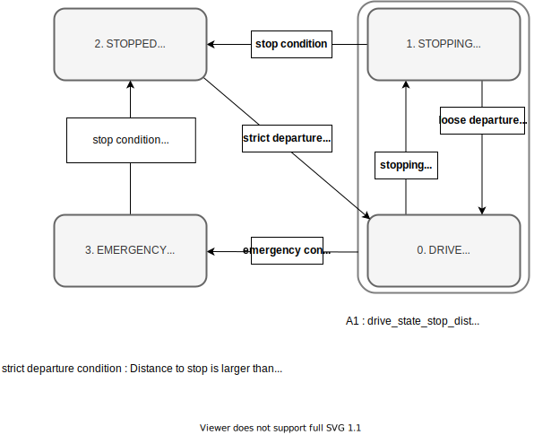

# Velocity Controller

## Purpose / Use cases

velocity_controller は目標軌道上の各点に設定された目標速度を実現するための機能であり、フィードバックループを用いて自車速度と目標速度から目標加速度を出力します。
道路勾配情報を考慮した勾配力補正や、遅延補正の機能なども含まれています。
ここで計算された目標加速度は、後段の車両インターフェースによって適切に実現されることを想定しています。

なお、自動運転を行う車両が「目標速度」のインターフェースに対応している場合は、Autoware としてこのモジュールの利用は必須ではありません。

### why separate lateral (steering) and longitudinal (velocity) control?

この速度制御モジュールは、以下のように縦横制御の役割が分離されていることを想定しています。

- ステア制御は、速度が理想状態で制御されている仮定のもと、車両を経路上に留めるためのステアリング目標値を計算する。
- 速度制御は、車両が理想状態で経路上に存在するという仮定のもと、車両速度を経路速度に合わせるための目標速度/加速度を計算する。

理想的にはステアと速度の制御を 1 つの混合問題として捉えて制御することによって、性能は向上します。対して、速度制御を単体の機能として提供する理由は 2 つあります。

#### Complex requirements for longitudinal motion

人間が車両に期待する縦方向の動作は、単体のロジックで表すことは困難です。たとえば停止直前において、車両の現在位置が停止線の前後なのか、現座速度が目標速度と比べて高いかのか低いかのか、などに応じて期待する動作は異なります。
また、通常の車両は極低速の車速測定は困難であり、低速域での観測精度が著しく劣化するという特徴を持ちます。

このように、縦方向の制御に固有の特性やニーズが多く存在します。これらを横方向制御とは分離して設計することはモジュールの結合度を低く保ち、保守性を向上させます。

#### Nonlinear coupling of lateral and longitudinal motion

ステアと速度の統合制御問題は非常に複雑であり、多くの場合、性能を出すために非線形最適化が用いられます。このロジックは収束性が保証されないという観点で安全ではありません。
また、車両限界近傍での制御を考えない場合は、縦横同時に制御を行うメリットは小さく、一般公道での通常走行において分離型で性能に困ることはほとんどありません。

（ここで述べているのは目標値追従問題における統合制御のメリットであり、経路計画においては縦横同時に計画するメリットは存在することに注意）

#### So, how should we consider lateral and longitudinal motion simultaneously?

一方で、例えば以下のようなケースでは縦と横の動きを同時に考えて設計するべきです。

- カーブに近づくので減速したい
- 車両が経路から逸れている場合は低速走行で経路に復帰したい

ただし、これらは制御の内部情報を利用せずに実行可能であるため、これらの機能は上段の速度計画や経路計画モジュールに置いて適切に設計されることを想定しています。
制御モジュールは、あくまで計画された速度/経路位置を守るためのものであり、このモジュール自体が期待する挙動自体（計画モジュールの出力）を上書きすることはありません。

## Design

### Assumptions / Known limits

1. 適切に平滑化された目標速度およびその加速度が軌道に埋め込まれていること
   1. 制御内部で目標値を書き換える処理は行いません（ノイズ処理程度のことは行う可能性がある）。
   2. 急なステップ状の目標値変動に対しては、可能な限り高速で追従を行います。
2. 車両速度が適切な値であること
   1. 前後方向に対応する符号付きの速度が与えられること
   2. EKF などによって適切にノイズ処理が施された車輪速が与えられること
   3. 自車速度に大きなノイズが乗っている場合は追従性能は著しく下がります
3. 後段の機能によって、目標速度/目標加速度が実現されること
   1. 車両のインターフェースが目標加速度でない場合（アクセルブレーキなど）は、適切な変換モジュールを挟む必要があります。

### Inputs / Outputs / API

#### output

- control_cmd [`autoware_control_msgs/ControlCommandStamped`] : command to control the vehicle for the longitudinal motion. It contains the target velocity and target acceleration.
- debug_values [`std_msgs/Float32MultiArray`] : debug values used for the control command generation (e.g. the contributions of each P-I-D terms).

#### input

- current_velocity [`geometry_msgs/TwistStamped`] : Current ego-velocity. `/localization/twist` is currently used in the Autoware.iv.
- current_trajectory [`autoware_planning_msgs/Trajectory`] : Current target trajectory for the desired velocity on the each trajectory points.
- /tf [`tf2_msgs/TFMessage`] : For ego-pose.

#### Note: why the debug message uses the multi-array?

Ideally, this message should be defined as a specific debug message with meaningful field names, like `VelocityControllerDebugValues.msg`. However, these debug values are fluid and new items are frequently added on the development phase, and unfortunately, adding a new field to a ros message definition is not backward compatible. Whereas, new elements can be added in the array-type message without any burden. This is why the `Float32MultiArray` type is currently used for now. The content of each element is defined in the header file.

## Inner-workings / Algorithms

### States

停止時の特殊処理などに対応するために、このモジュールは以下のように 4 つの状態遷移を持ちます。

- **DRIVE**
  - pid 制御によって目標速度追従を行う
  - 遅延補償や勾配補償の機能も適用される
- **STOPPING**
  - 停車直前の動作を制御します
  - 停止精度や滑らかな停止のための特殊処理が実行されます
- **STOPPED**
  - 停止状態での動作を行います（ブレーキホールドなど）
- **EMERGENCY**
  - 特定の条件を満たした場合には緊急状態に入ります（停止線を一定以上超えた場合など）。
  - 解除条件（停止するまで解除しないかどうかなど）や、緊急制動時の減速度はパラメータによって管理されます。

状態遷移図を以下に示します

### Logics

#### Control Block Diagram

#### FeedForward

目標軌道に埋め込まれた加速度、および勾配補正項を FF 成分として出力します。モデル化誤差がない理想下においては、この FF 項のみで適切な速度追従が可能です。

離散化やモデル化誤差によって生じた追従誤差は feedback 系によって取り除かれます。

#### Brake keeping

加速度 0 で停止することは停止時のブレーキの衝撃を緩和するため、乗り心地の観点において重要です。
しかし停止際の目標加速度を 0 で出力すると、車両モデル誤差や勾配推定誤差によって停止線で止まりきれなかったり、停止際で車両が加速して乗員に違和感を与えることがあります。

この機能は、停止際での停止を確実にするため、停止際において FeedForward 系で算出された目標加速度を負の値でリミットします。

#### Slope compensation

勾配情報をもとに、目標加速度に勾配力成分を付与します。

この勾配情報は 2 つのソースがあり、切替可能です

- 自己位置のピッチ成分（default）
  - 自己位置のピッチ角から現在の勾配を計算する
  - Pros: 簡単に利用可能
  - Cons: 車体の振動の影響を受けるため、精度の良い勾配情報を抽出することができない
- 経路の z 座標
  - 目標経路における前輪と後輪位置での z 座標の差分から道路勾配を計算する
  - Pros: 経路の z 座標が適切に整備されている場合は、自己位置推定のピッチ推定よりも高精度である
  - Pros: 遅延補償と組み合わせて利用が可能（機能は未実装）
  - Cons: 高精度地図の z 座標を適切に整備する必要がある
  - Cons: （現時点では）フリースペースでの計画に対応していない

#### PID control

モデル誤差などの FeedForward 制御で対応できない偏差に対して、PID 制御を用いてフィードバック系を構築します。

この PID 制御は、現在車速と目標車速の偏差から目標加速度を計算します。

この PID ロジックには、各項の出力に最大値を設けています。これは以下を防ぐためです。

- 大きな積分項は開発者の意図しない挙動を引き起こす恐れがある
- 意図しないノイズにより、微分項の出力が非常に大きな値になる恐れがある

また、積分項は速度 0 のときには蓄積されません。これは「Autoware としては発車想定をしているが、外部ユーザによって車両の発進にロックが掛けられている」ようなケースにおける意図しない積分項の蓄積を防ぐためであり、本質的にはこの速度計画モジュールが車両駆動を真に開始する信号を取得できないことが原因です。
一方で、発進時に路面の窪みにはまってスタックした場合には、いつまでも発進しないといった課題もあり、ここは現在対応中です。

なお、現在は開発/メンテナンスコストと性能のトレードオフの観点から PID 制御が実装されています。
ここは、今後の開発において、より高性能な制御系（adaptive control やロバスト制御）による置き換わっていく可能性があります。

#### Time delay compensation

高速走行時において、アクセルやブレーキなどのアクチュエータ系が持つ遅延は、走行精度に大きな影響を及ぼします。
車両の駆動原理に依存しますが、アクセルブレーキを物理的に制御する機構は一般的に数 100ms の遅延を有します。

この速度制御では、制御モジュール内部で遅延時間後の自車速度と目標速度を計算し、予め先の状態を用いて制御系を組むことにより、遅延時間に対応しています。

## References / External links

-

## Future extensions / Unimplemented parts

-

## Related issues

-
